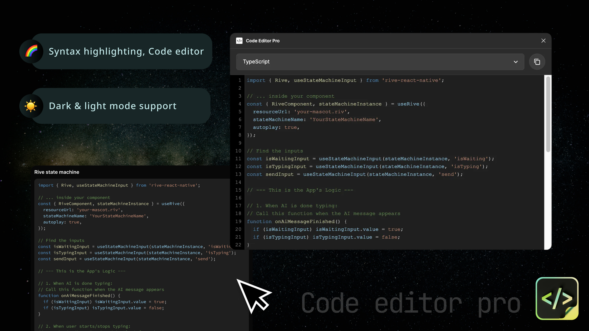

# Code Editor Pro




A Figma widget for writing and previewing syntax-highlighted code blocks.

## What It Does

- Opens a full code editor when you click a block
- Supports multiple languages (JS, TS, Python, HTML, CSS, JSON, SQL, Markdown, XML)
- Shows syntax-highlighted code inside the widget
- Lets you switch between dark and light themes from the widget property menu
- Auto-adjusts widget width based on code length
- Keeps code synced between the editor UI and widget

## Install

1. Clone this repo
2. Run `npm install`
3. Run `npm run build`
4. In Figma: `Plugins -> Development -> Import plugin from manifest`
5. Select `manifest.json`

## Development

```bash
npm run build      # Build widget + UI
npm run build:ui   # Build UI only
npm run tsc        # Type check
npm run lint       # Lint
npm run lint:fix   # Auto-fix lint issues
npm run watch      # Rebuild on file changes
```

## Project Structure

```text
widget-src/
  code.tsx         Main widget logic
  ui.html          Editor UI (CodeMirror)
  ui.tsx           UI entry
  constants.ts     Theme + layout constants
  utils.ts         Helpers
  types.ts         Shared types
  components/      Widget UI components
manifest.json      Figma plugin manifest
```

## Tech Stack

- Figma Widget API
- TypeScript
- esbuild
- CodeMirror

## License

MIT
